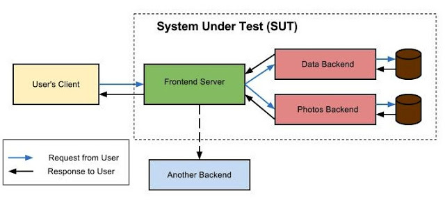
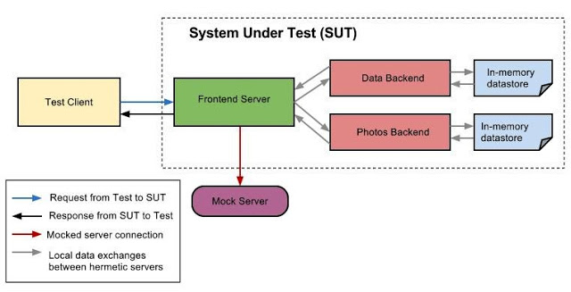

## 密闭服务器(Hermetic Servers)

想像一下，我们有一个复杂的富Web应用程序。在其之下，可能是由错综复杂的服务器集群提供服务，每个服务器执行不同的任务，而且大多数服务器之间都有交互。任何的用户操作都会经历一个迷宫之旅，从用户点击开始，到数据存储之间，需要经过很多服务调用。很多谷歌的网络应用都是这样的，包括Gmail和Google+。那么，我们如何为它们编写端到端的测试呢？

#### 端到端测试

在Google所有测试组成的世界中，一个端到端测试是指用于检查到完整整服务栈，从用户请求开妈，到得到最终的响应。下图中是一个端到端测试用来检查被测系统的简要流程图。值得注意是主，在被测系统中的前端服务器会连接一个第三方的后端服务，而它是当前这个模拟用户并不需要调求的。

为这样的系统写快速及可靠的端到端自动化测试用例有很多挑战。挑战之一就是避免网络访问。包含网络访问的自动化测试要比仅使用本地资源要慢，而且由于外部服务可能存在的不可用性或者对其不可控性，使用外部服务很可能会导致[测试随机失败问题](02-04avoiding-flakey-tests.md)。

#### 密闭服务器

我们在谷歌用于设计端到端测试的一种技巧就是使用密闭服务器(Hermetic Servers)。

使用是密闭服务器？简单来说，就是指运行在同一个节点的服务器。如果你能够在同一个机器上启动所有需要的服务器(即不需要访问网络），而且服务器的行为与预期保持一致，那么，你就有"密闭服务器了"。通常的"密闭"是指完全与外界隔离的系统，并不必须是在同一台机器上，所以，这里的密闭服务器算是它的一种特例。

为什么密闭服务器是有益的？如果你的被测系统是由密闭服务器构成的，就可以在单台服务器上完整启动；也就没有必要进行网络访问了。单台服务器既可以是一台物理机器，也可以是一台虚拟机器。

#### 密闭服务器的设计

构建密封服务器的过程是在对任何新服务设计的早期就应该考虑的。我们需要注意的事项如下：

- 所有对外部服务的连接都应该使用某种合适的"依赖注入"的方式在运行时注入，例如命令行启动参与，或者[Guice](http://code.google.com/p/google-guice/)。
- 所需的静态文件都应该与服务的二进制文件绑定在一起。
- 如果服务器需要访问数据存储，确保数据存储可以使用数据文件或者内存式数据存储来冒充（faked）。

满足上述要求就可以确保我们有了高度可配置的服务器，就有成为一个密闭服务器的潜质了。但它还没为在测试中使用而准备好。我们还需要再做几件事情才可以：

- 确保我们测试中没有使用到那些连接点要有适当的冒充([fakes](http://xunitpatterns.com/Fake%20Object.html))或模拟(mocks)去验证这种不连接性。
- 提供一些模块(modules)，使得更容易使用测试数据来组装数据存储。
- 提供一些日志模块(log modules)，追踪被测系统中的请求/ 响应链路。

在测试中使用密闭服务器

我们以上面图中的例子来讲解一下密封服务器的使用。首先，我们假设所有的服务都是密封服务。下面是对同一个用户请求，端到端测试是如何运行的：

端到端测试的步骤如下：

  - 启动图中的被测试系统
  - 通过测试用的客户端向被测系统发出一个请求
  - 验证从被测试系统返回的响应结果。

这里需要注意的一点是：在这个测试中，我们并不需要连接这个模拟的后端服务器。如果我们真的想要测试一个需要这个后端服务器的请求，我们也必须在连接点提供一个密封服务。

这种端到端测试**更可靠**，因为它不使用网络连接。它**更快**，因为它所需要的一切都在内存或本地硬盘中可用。

  

谷歌是在其持续集成系统上运行这种测试，因此对于被测系统中的任何一个服务做出代码变更时，它们都会被运行。一旦测试失败，日志模块将帮助跟踪被测系统中发生故障的位置。

谷歌在很多端到端测试中使用了密封服务。一些常见的情况包括：

  - 使用[Guice](https://github.com/google/guice) 对服务器进行启动测试，以验证启动时没有Guice 错误。
  - 对后台服务进行API测试。
  - 迷你性能测试。
  - 前端服务的UI和API测试。

#### 结论

密闭服务器的确有一些限制性。它们将增加测试的运行时间，因为每次运行端到端测试时都必须启动整个SUT。如果你的测试使用有限的资源（如内存和CPU）运行，那么当服务器交互变得越来越复杂时，密闭服务器可能会使测试超过这些限制。另外，在内存数据存储中使用的数据集大小也比真实的生产数据存储的数据集要小得多。

密闭服务器是一个很好的测试工具。像所有其他工具一样，它们需要在适当的地方得到深思熟虑的使用。