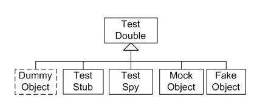

## 测试替身的家族(Test Double)

自动化测试中，我们常会使用一些经过简化的，行为与表现类似于生产环境下的对象的替身。引入这样的替身对象能够降低构建测试用例的复杂度，允许我们独立而解耦地测试某个模块，不再担心受到系统中其他部分的影响。

Gerard Meszaros 在[XunitPatterns](https://link.jianshu.com/?t=http%3A%2F%2Fxunitpatterns.com%2FTest%2520Double.html)中对此类对象的定义。他对这类对象统一称呼为：Test Double。包含：**Dummy，Fake，Spy，Mock和Stub。**

对于 Test Doubles 实现的误解还是可能会影响到测试的设计，使测试用例变得混乱和脆弱，最终带来不必要的重构。下面我们来了解一下它们之间的些许不同之处，以及各自的使用场景。

#### Dummy Object

Dummy是在测试中仅发挥占位填充符的作用，在测试中不会被使用，也不参与测试行为或状态的验证。常见的场景是作为被测函数的某个参数占位符，以减少参数的构造成本。

#### Fake Object

Fake 是模拟被测系统所依赖的那个组件，它是生产环境下这个被依赖组件的功能实现的简化版本。Fake对象是用于测试的，但它既不是测试中的控制点([control point](https://link.jianshu.com/?t=http%3A%2F%2Fxunitpatterns.com%2Fcontrol%2520point.html) )，也不是观测点([observation point](https://link.jianshu.com/?t=http%3A%2F%2Fxunitpatterns.com%2Fobservation%2520point.html) )。

一个常见的使用场景就是利用 Fake 来保证在测试环境下支付永远返回成功结果，前提是被测对象并不是支付系统。

#### Stub Object

Stub提供在测试过程中对请求调用的屏蔽式应答，通常对该测试程序之外的任何内容都无响应。即：Stub只是返回一个规定的值，而不会去涉及到系统的任何改变。它通常是测试中的控制点(control point)。

比较常见的场景就是系统希望去查询某一类的信息，而Stub可以总是返回一个固定值，比如发送邮件的功能，Stub可以总是返回邮件发送成功的标识1，但是你并不知道你到底发送了邮件给谁或者发送了几封邮件。

#### Spy Object

Spy可以看做是一类Stub，但是，它会记录它在被调用后的一些信息。例如，它被用于模拟email 服务，并记录用它发送了多少邮件。

#### Mock Object

Mock 通常会被作为观察点，用于验证被测系统（SUT）在执行时的间接输出（即观测点）。通常，Mock对象还会发挥Stub的作用，因为如果测试尚未失败，它必须将值返回到SUT，但其重点是验证间接输出。因此，一个Mock对象不仅仅是一个Stub和断言，它的使用方式有着根本的不同。所以，它既可以是Observation Point，也可以发挥Control Point的作用。

**Mock**和**Stub**有一定的重合性，比较大的区别是Mock专注于observation point，而Stub专注于control point。或者从另一个角度上面来说，Mock会验证行为的变更，而Stub只是状态的一个变化而已。

