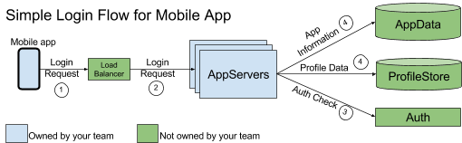

## 写好端到端的自动化测试

端到端测试就是用来测试整个系统的，即从给这个系统输入信息开始，到获取返回的输出信息，将它看成一个黑盒。**端到端测试可以捕获整个系统中出现的缺陷**。除了单元测试和集成测试之外，它是均衡测试谱系的重要组成部分，在类生产状态下为您的系统健康提供信心。不幸的是，与单元测试和集成测试相比，端到端测试运行得**更慢，更不稳定，而且维护成本更高**。所以每写一个端到端测试用例，都要思考是否有必要。如果答案是肯定的，那么，又如何编写一个好的端到端测试呢？

让我们以下面的登录流程为例，考虑一下端到端的测试是如何工作的：

为了节约成本，端到端测试应该关注系统中无法使用较小型的自动化测试可靠评估的那些方面，例如资源分配、并发性问题和API兼容性等，具体的说就是：

- **对于每个重要的用例（use Case），应该有一个对应的端到端测试。**这应该包括对每个重要类型的错误的一个测试，其目标是保持低数量的端到端测试数量。
- **每个季度都要至少准备出一个星期的时间，保证端到端测试的稳定**，以便一旦面对运行慢、不稳定的依赖或者小的UI变更等问题时，不至于手忙脚乱。
- **聚焦于验证整体的系统行为，而不是具体的实现细节**；例如，当测试登录行为时，应该验证整个流程是否成功，且应该与那些可能会频繁更改的确切消息显示或可视化布局相分离。
- 通过提供一个概览级别的日志文件，记录常见的测试失败模型（modes），以及保存相关的系统状态信息（例如截图，数据库快照等），**让端到端的测试更容易调试**。

端到端测试还附带一些重要注意事项：

- 由其它团队维护的系统组件可能会在不知情的情况下被改变，从而让你的测试失败。这会增加整体维护成本，但同时也就突出了那些不兼容的变更。
- **让端到端测试完全做到封闭性可能会更难一些**；残剩的测试数据可能会改变将来的测试结果和/或生产系统。所以，只要可能，尽量保证测试数据的生命短暂性。
- 一个端到端的测试常常需要多种底层依赖项的测试替身对象 ([fakes or stubs](02-10stub-faked-mock.md)) ；它们可能会产生很高的维护成本，因为随着时间的推移，它会与真实的系统实现之间产生差异。